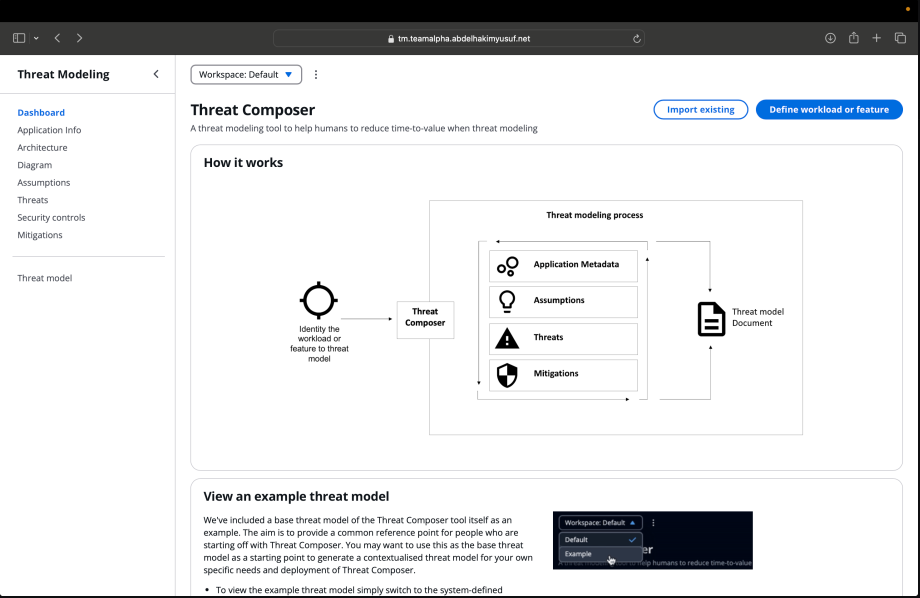

# Threat Composer Tool: A Threat Modelling and Security Assessment Solution

This project utilises Amazon's open-source **Threat Composer Tool** – a robust solution that facilitates **threat modelling** to improve **security assessments**. By providing a structured framework and a prescriptive "Threat Grammar," the Threat Composer Tool empowers users to systematically build and manage threat models that can evolve alongside system development. [Explore the tool's dashboard here.](https://awslabs.github.io/threat-composer/workspaces/default/dashboard)

## Project Overview


This project deploys the Threat Composer Tool on **AWS** using **containerised microservices** orchestrated by **ECS** (Elastic Container Service) and provisioned through **Terraform**. The setup includes a comprehensive **end-to-end automation workflow** with containerisation, CI/CD pipelines, and secure deployment, ensuring an efficient and scalable flow from development to production.

We selected **Amazon ECS** as the container orchestration platform for its scalability and seamless integration with other AWS services. ECS is a fully managed service that simplifies deploying and managing containers, reducing operational overheads. We also opted for **AWS Fargate**, a serverless compute engine for ECS, allowing containers to run without the need to manage the underlying infrastructure. Fargate automatically scales based on demand, providing flexible, cost-effective resource management, which is ideal for deploying the Threat Composer Tool.

AWS offers a reliable, scalable cloud infrastructure with tools specifically designed for security-focused applications, making it an excellent choice for this project.

---

## 🚀 Threat Modelling Purpose and Benefits

The **Threat Composer Tool** aims to streamline the threat modelling process by providing an organised framework to:

- **Identify** potential security threats in a structured and thorough manner 🕵️‍♂️
- **Document** threats consistently, enabling clear and transparent communication 📜
- **Mitigate** risks effectively through actionable security insights 🛡️

Using structured questions, the tool supports brainstorming and the creation of detailed threat models. Additionally, the **insights dashboard** highlights areas for improvement, ensuring:

- Comprehensive **threat coverage** across your systems 🌐
- Continuous **iteration and improvement** as your system evolves 🔄

With Threat Composer, teams can proactively enhance security by addressing potential risks early in the design process. This approach supports the **iterative development** of a "living" threat model that adapts as your system grows.

---

## 🛠️ Task/Assignment 📝

1. **Repository Setup**  
   - Set up a GitHub repository, ensuring files are well-organised and a clear README is present for easy navigation.

2. **Containerisation**  
   - Create a Dockerfile following best practices. Use **multi-stage builds** if applicable to optimise the container image. Push the image to **ECR** (Elastic Container Registry) or **DockerHub** with a robust tagging strategy.

3. **Infrastructure as Code (IaC) with Terraform**  
   - Provision all AWS resources using **Terraform**. Terraform is an Infrastructure as Code (IaC) tool that allows us to define cloud resources programmatically, making it easy to deploy, modify, and maintain infrastructure consistently.
   - Using **Terraform modules** enables scalable, modular configurations, ideal for setting up ECS, load balancers, and networking.
   - **AWS** is chosen as the cloud provider for its flexibility, scalability, and managed services, ensuring a robust environment for deploying this security-focused tool.

4. **CI/CD Pipelines**  
   - Implement **GitHub Actions** to automate the build, test, and deployment processes, securely handling credentials. This pipeline will push the Docker image to the registry and deploy it on ECS.

5. **HTTPS & DNS Setup**  
   - Ensure the app is accessible over HTTPS at `https://tm.<your-domain>` via a load balancer. Use **Route 53** for DNS resolution and **AWS Certificate Manager** (ACM) for SSL certificates, achieving secure, reliable access to the application and simplifying DNS and certificate management.

6. **Architecture Diagram and Documentation**  
   - Create a detailed **architecture diagram** using Lucidchart, draw.io, or mermaid to illustrate the infrastructure setup and data flow from DNS to ECS.
   - Include screenshots of the live app in the README, along with step-by-step documentation from local build to deployment to provide a complete overview of the project setup.


---

## 💻 Local App Setup

To set up and run the Threat Composer Tool locally, follow these steps:

1. **Install Dependencies**  
   Begin by installing all necessary dependencies. This project uses **Yarn** as the package manager, so make sure Yarn is installed on your machine. If not, you can install it by following the instructions on [Yarn's official site](https://classic.yarnpkg.com/en/docs/install).

   Run the following command to install the dependencies listed in `package.json`:

   ```bash
   yarn install

2. **Build the Application**

   After installing the dependencies, you’ll need to build the app. This step compiles the application, preparing it for deployment or serving it locally. Building the app is essential to ensure that all code and assets are ready for use.

   Run the following command to build the application:

   ```bash

   yarn build

3. **Install the serve Package Globally**

   To serve the built app locally, we recommend using the serve package, which is a simple static file server for Node.js. Install it globally so that it can be used anywhere on your system:

   ```bash

   yarn global add serve


4. **Serve the App**

   Now that you’ve built the application and installed the serve package, you can run the app locally. The -s flag in the command specifies that serve should run the app in single-page application (SPA) mode, handling client-side routing correctly.

   Run the following command to serve the built application:

   ```bash

   serve -s build

5. **Access the Application**

   Once the application is running, you can access it in your web browser. Open your browser and go to:

   ```bash

   http://localhost:3000/workspaces/default/dashboard

Here, you’ll see the dashboard interface for the Threat Composer Tool, allowing you to explore its features locally.



## 🐞 Troubleshooting Tips


- Port Issues: If localhost:3000 is already in use, specify a different port by appending the -l flag with a port number. For example, serve -s build -l 4000 to run it on localhost:4000.

- Yarn Not Recognized: If you encounter errors about Yarn not being recognised, confirm that Yarn is installed by running 
   ``` bash
   yarn --version. 
If it’s not installed, follow the installation instructions linked above.